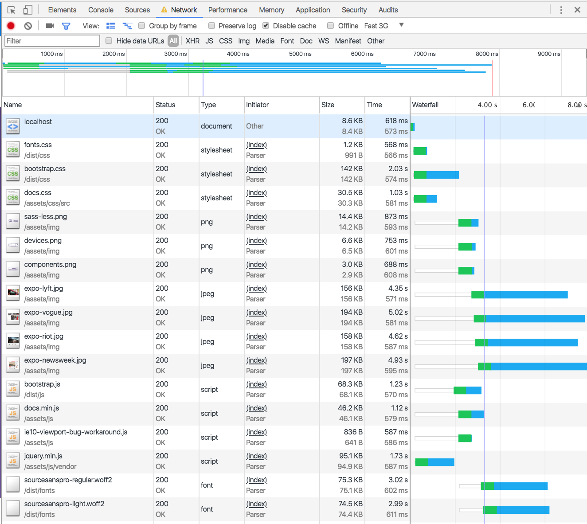
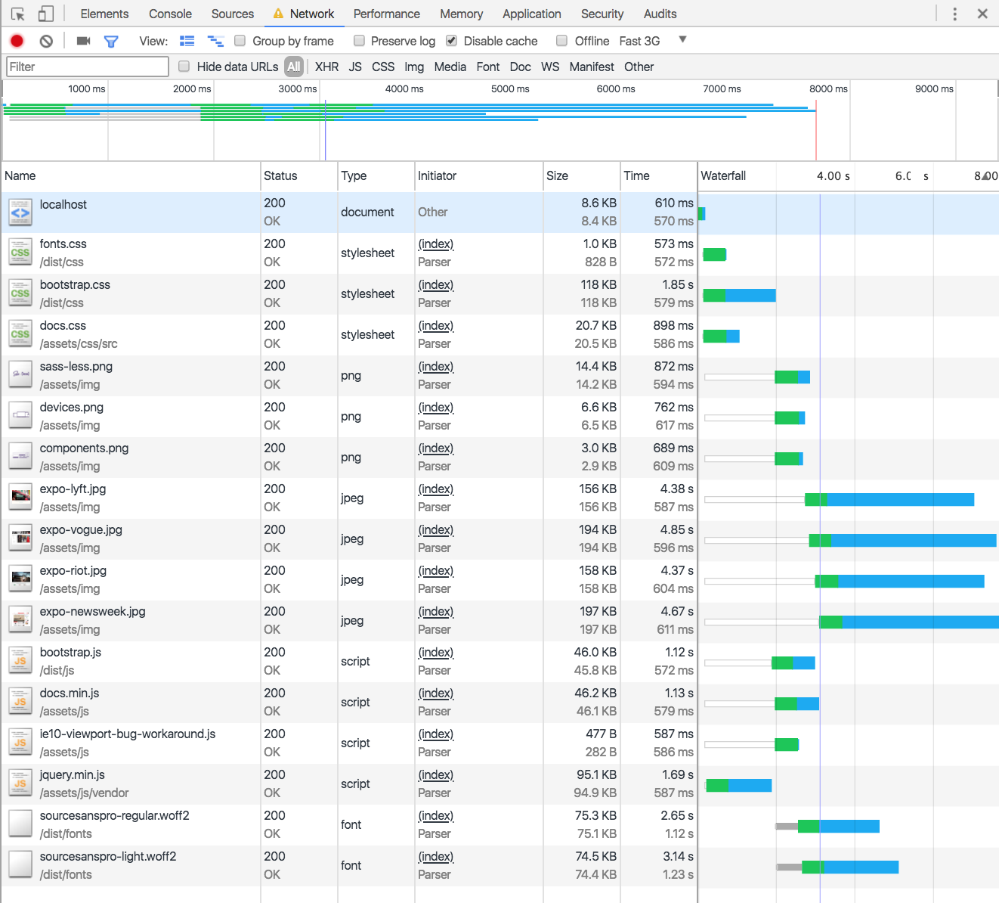
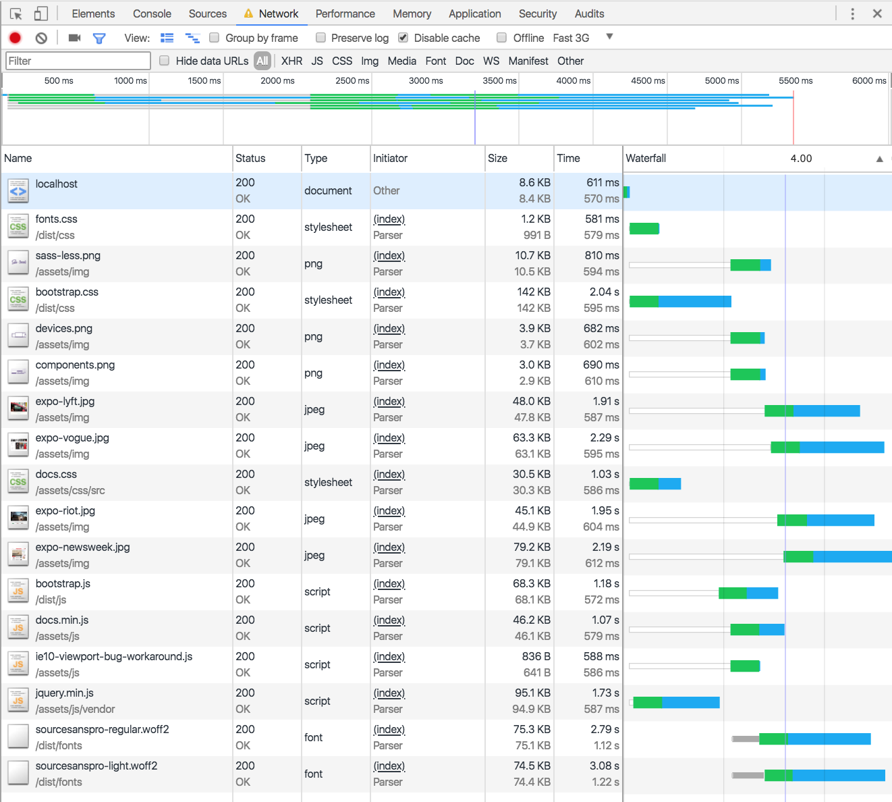

### Changes to optimalize performance

This screenshot is from the master branch, without any changes or additions. All screenshots can be compared to this one. 
_Measured on fast 3g_
> speed: 8000 ms




#### minify JS & CSS 

By using [minify](https://www.minifier.org/) I minimized the CSS and JS without changing their functionality. 

file | this branch | master branch
-----|-------|--------------
fonts.css | 573 ms | 618 ms 
bootstrap.css | 1.85 s | 2 s
docs.css | 898 ms | 1.03 s
bootstrap.js | 1.12 s | 1.23 s
docs.min.js | 1.10s | 1.12 s
ie10-viewport-bug-workaround.js | 587 ms | 587 ms
jquery.min.js | 1.69 s | 1.73 s

The biggest changes won't be in this excercise, but it still helps.



#### compress images

By using [tinypng](https://tinypng.com/) I manually compressed the images by uploading and downloading them.

file | this branch | master branch
-----|-------|--------------
sass-less.png | 810 ms | 873 ms 
devices.png | 680 ms | 753 ms
components.png | 690 ms | 688 ms
expo-lyft.jpg | 1.91 s | 4.35 s
expo-vogue.jpg | 2.29 s | 5.02 s
expo-riot.jpg | 1.95 s | 4.62 s
expo-newsweek.jpg | 2.19 s | 4.93 s

> overall speed: 5500 ms instead of 8000 ms

Especially the jpg files reduced in seconds, from 4 - 5 seconds to 1 - 2 seconds in loading.



#### Font loading

By using `display:swap;`, the standard font is shown first, while the actual font is loading. This helps the user experience, as the screen isn't empty while the font is loading.

```css
@font-face {
    font-family: 'source_sans_pro';
    src: url('/dist/fonts/sourcesanspro-regular.woff2') format('woff2'),
    url('/dist/fonts/sourcesanspro-regular.woff') format('woff');
    display: swap;
    font-weight: 400;
    font-style: normal;
}
```

#### Load CSS async

Instead of just loading the link like  
```css
 <link href="/dist/css/fonts.css" rel="stylesheet">
 ``` 
 you can carry this out like this: 
 ```css
<link rel="preload" href="/dist/css/fonts.css" as="style" onload="this.rel='stylesheet'">
+    <noscript><link rel="stylesheet" href="/dist/css/fonts.css"></noscript>
 ```

By referencing CSS with just link + href, browsers delay the page while the CSS is loading. Loading stylesheets that aren't important for the page rendering, the blocking behaviour makes the page load longer for no reason. 

With the rel="preload" way of referring to stylesheets, we are enabled to load stylesheets asynchronously. After this, a <noscript> fallback carries the regular link element.

